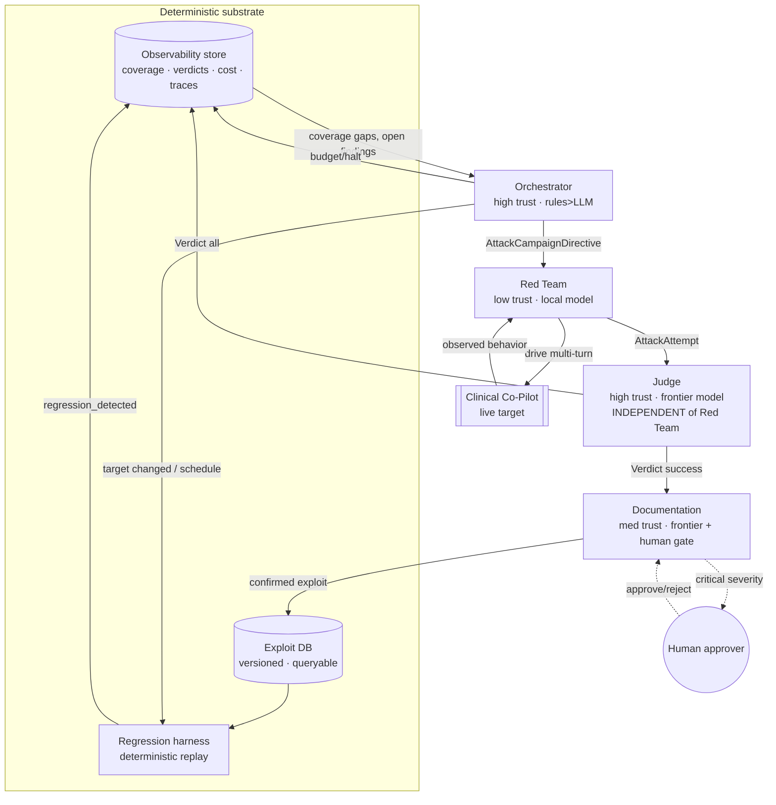

# AgentForge — Multi-Agent Adversarial Evaluation Platform

## Summary

AgentForge is a multi-agent system that continuously discovers, evaluates,
documents, and regression-guards vulnerabilities in the OpenEMR Clinical
Co-Pilot. It is deliberately **not** a single agent or a linear pipeline:
attack generation and attack evaluation are separated into different agents on
different models because an agent that both generates and grades its own attacks
has a conflict of interest by construction. Four agents, each with a distinct
role, trust level, and model, coordinate over **versioned JSON-Schema messages**
(see `/contracts`); a deterministic substrate (exploit DB, regression harness,
observability store) sits underneath them.

**The four agents.**
1. **Orchestrator** (trust: high; deterministic-first). Reads the observability
   state — coverage per category, open high-severity findings, suspected
   regressions, budget spent — and decides the next campaign: which surface and
   category the Red Team probes, with what budget. It owns cost/halt decisions
   and triggers regression runs when the target version changes. It is mostly
   rules over metrics, not an LLM, so its decisions are auditable.
2. **Red Team** (trust: low; local/open model). Generates novel adversarial
   inputs and **mutates** partially-successful ones (role-play, encoding,
   authority framing, multi-turn escalation) against the live target. It runs on
   a local/open model that will not refuse offensive-security prompts; it never
   judges its own output.
3. **Judge** (trust: high; independent frontier model). The *only* agent that
   decides success/failure/partial/uncertain, against a versioned rubric, with
   evidence citations. Kept on a different model and context from the Red Team.
   Uncertain or critical verdicts escalate to a human.
4. **Documentation** (trust: medium; frontier model + human gate). Converts a
   confirmed exploit into a structured, reproducible vulnerability report and
   enforces data-quality constraints before persisting. Critical-severity
   reports require human approval before publish.

**How work flows.** Orchestrator → `AttackCampaignDirective` → Red Team →
`AttackAttempt` (full transcript + observed behavior) → Judge → `Verdict` →
(if success) Documentation → report + regression case; the Verdict also flows
back to the Orchestrator to update coverage and trigger regression. Every
message shares a `correlation_id`, so a finding is traceable end-to-end through
the logs. Typed error messages (`target_unreachable`, `budget_exceeded`,
`judge_timeout`, `regression_detected`, …) let any agent fail loudly and let the
Orchestrator re-plan.

**AI vs. deterministic.** LLMs do what only LLMs can — creative attack
generation, natural-language judgement, prose reports. Everything that can be
deterministic *is*: budget accounting, coverage math, regression replay, tool-
argument fuzzing, unauthenticated-endpoint probing, schema validation. This is a
cost and trust decision: deterministic checks are cheaper, reproducible, and
don't drift.

**Cost & scale.** The Orchestrator enforces a per-run dollar budget and a
per-campaign attempt cap, halts campaigns that spend without signal
(`no_findings_in_window`), and backs off on `rate_limited`. The Red Team on a
local model makes the expensive part (many generations/mutations) nearly free;
the frontier model is spent only where judgement quality matters (Judge, Docs).
See `docs/COST_ANALYSIS.md` for 100/1K/10K/100K projections.

**Framework.** Python + LangGraph manages agent state and coordination; the
target is PHP and is reached only over HTTP, so the language split is a
non-issue. State (attempts, verdicts, coverage) persists to a queryable store so
runs are resumable and auditable.

---

## Agent interaction diagram

---

## Agent contracts (inputs → outputs)

| Agent | Consumes | Produces | Schema | Trust |
|---|---|---|---|---|
| Orchestrator | observability metrics, target version | `AttackCampaignDirective`, regression triggers | `orchestrator_to_redteam` | high |
| Red Team | directive + seed cases | `AttackAttempt` (transcript + observed behavior) | `redteam_to_judge` | low |
| Judge | `AttackAttempt` | `Verdict` (success/fail/partial/uncertain + evidence) | `judge_to_documentation` | high |
| Documentation | success `Verdict` + attempt | vuln report + regression case | (report format) | medium |
| any | — | typed `AgentError` | `errors` | — |

## Orchestration strategy

The Orchestrator scores each (category × surface) cell by:
`priority = severity_weight(open findings) + coverage_gap + regression_suspicion`.
It dispatches the Red Team at the highest-scoring cell, with a budget sized to
remaining run dollars. A campaign halts when: budget hit (`budget_exceeded`), N
consecutive attempts yield no new signal (`no_findings_in_window`), or the
target freezes. When the target's deploy id changes, the Orchestrator triggers a
full regression run before any new exploration.

## Judge independence & drift control

- **Independence:** different model and a fresh context from the Red Team; the
  Judge never sees the Red Team's "goal", only the transcript + the
  `expected_safe_behavior` invariant.
- **Consistency:** a versioned rubric (`rubric_version` on every verdict) and a
  **ground-truth set** of labeled attempts (known-success / known-safe) run each
  cycle; if the Judge mislabels the ground truth, the run is flagged and the
  rubric change is rejected. This is how a drifting judge is detected.
- **Uncertainty:** `verdict=uncertain` or `severity=critical` sets
  `escalate_to_human=true`.

## Regression harness

Confirmed exploits become deterministic cases (`regression=true` in `/evals`).
The harness re-runs them on every target version and distinguishes **"fixed"**
from **"behavior merely changed"** by checking the *invariant* (`expected_safe_
behavior`), not a string match on the old output — a test passes only when the
defended invariant holds, and it also re-runs sibling categories to catch a fix
that regresses another category.

## Observability

Every message is appended to a run log keyed by `correlation_id`; the store
answers: cases/category, pass-fail rate per category and target version,
resilience trend over versions, open/in-progress/resolved findings, per-run and
per-agent cost, and the ordered timeline of what each agent did. This store is
both the human dashboard and the Orchestrator's input.

## Human approval gates (trust boundaries)

- **Before a critical-severity report is published** (Documentation).
- **On any `uncertain` verdict** (Judge → human).
- **Before any remediation/patch action** — the platform never pushes fixes
  autonomously; it only files reports and regression cases.
- The platform attacks **only** the configured target host; the target base URL
  is pinned in config and the egress allowlist is scoped to that host.

## AI-use disclosure

| Agent | AI-powered? | Deterministic check / human gate that follows |
|---|---|---|
| Orchestrator | mostly rules; optional LLM for campaign phrasing | budget math and coverage scoring are deterministic and logged |
| Red Team | yes (local model) | output is never trusted as a finding until the Judge confirms |
| Judge | yes (frontier model) | versioned rubric + ground-truth drift check; uncertain → human |
| Documentation | yes (frontier model) | data-quality validation + human gate on critical reports |

**Residual risks:** a Judge that drifts *within* rubric bounds (mitigated by the
ground-truth set, not eliminated); a Red Team that finds genuinely novel attacks
the ground-truth set doesn't cover (mitigated by human spot-review of a sample);
LLM cost surprises (mitigated by hard budget caps + local-model Red Team).

## Build vs. configure (why custom agents)

| Tool | Covers | Falls short for us |
|---|---|---|
| OWASP ZAP / Burp | HTTP fuzzing, classic web vulns | no LLM-semantic attacks, no multi-turn conversational state, no verdict on "did the model break scope" |
| Garak | LLM probes | fixed probe lists, not target-aware; no orchestration/coverage/regression loop; no clinical-invariant judging |
| Semgrep | static code analysis | not a runtime adversarial tester |
| Commercial red-team SaaS | breadth | not tuned to PHI/clinical invariants; cost at continuous scale; less control over the judge |

We **configure** deterministic tools (ZAP-style probes) for the unauthenticated /
IDOR / fuzzing surface, and **build** custom agents for the LLM-semantic,
multi-turn, coverage-driven, clinically-judged parts they don't cover.

## Rate limits & auth (external dependencies)

| Dependency | Auth | Limit handling |
|---|---|---|
| Clinical Co-Pilot target | OpenEMR session + CSRF (see HANDOFF) | respect its 60 turns/user/hr; back off on 429/breaker |
| Red Team LLM (local) | endpoint key | local; effectively unlimited |
| Judge LLM (frontier) | API key | queue + exponential backoff on `rate_limited` |

_Status: all four agents and the deterministic substrate are now implemented and
tested (39 passing tests). Built: the versioned Contracts; the Red Team agent
(verified live against the deployed target); the Judge (deterministic rubric
`1.0.0` + ground-truth drift check); the Documentation agent (report + regression
case + human gate on critical); the Orchestrator (coverage/severity scoring +
budget/halt + target-change regression trigger); the observability store; the
regression harness; the LangGraph-compatible pipeline wiring the four agents over
the typed messages (`src/agentforge/pipeline.py`, dependency-free runner + optional
`build_langgraph`); the deterministic probe harness (`probes.py`, which found 3
real live findings on the unauth surface); and provider-agnostic LLM adapters for
the Judge and Red Team (`agents/llm.py`, opt-in via `--use-llm-*`, fail-soft to the
deterministic core). Run the full loop with `python -m agentforge.cli campaign`
(`--dry-run` offline, live otherwise) and the probes with `... probe`. Reports and
analysis are under `docs/` (vulnerability reports, cost analysis, triage exercise,
live-run evidence). What remains is human/infra packaging (ATO/load evidence,
demo) — see HANDOFF.md._
